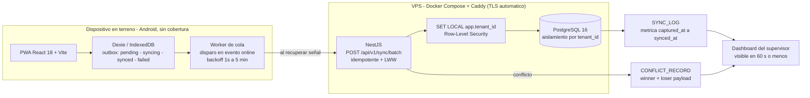

# Terreno Conectado — Datos al día, donde no hay señal

Plataforma SaaS **offline-first** de captura de datos operacionales para faenas mineras y obras de construcción en Chile. Captura local sin conexión, sincronización automática al recuperar señal, multi-tenant con datos aislados por empresa cliente.

Proyecto Capstone (PTY4614) — Duoc UC, Ingeniería en Informática, Sede Alameda.

## Equipo

| Integrante | Rol | GitHub |
| :--- | :--- | :--- |
| Daniel Ávila | Datos / lógica de negocio — specs, modelo de datos | [@danielandresavilaj-cell](https://github.com/danielandresavilaj-cell) |
| Raúl González | Infraestructura / validación — infra, despliegue, testing | [@ev6rlasting](https://github.com/ev6rlasting) |

## Tecnologías utilizadas

| Capa | Tecnología | Por qué |
| :--- | :--- | :--- |
| Lenguaje | **TypeScript** full-stack | un solo lenguaje en el equipo (ADR-001) |
| Frontend | React 18 + Vite | PWA instalable en Android de gama media |
| Almacenamiento local | **Dexie** (IndexedDB) | cola offline transaccional y madura |
| Service worker | **Workbox** | estándar de cache y precache del shell |
| Backend | **NestJS** (monolito modular) | estructura modular, tipos compartidos con el frontend |
| Base de datos | **PostgreSQL 16 + RLS** | aislamiento multi-tenant a nivel de motor |
| Identidad | JWT propio (access 15 min + refresh) | claims de tenant, $0, sin lock-in |
| Identidad de registro | **UUIDv7** generado en cliente | creación offline sin depender del servidor |
| Sincronización | Cola propia + ingesta idempotente por lotes | el corazón del proyecto, no se delega a un BaaS |
| Fotos | Compresión en cliente (canvas) + volumen Docker | $0; evolución a S3 documentada |
| Infra demo | 1 VPS + Docker Compose + Caddy | TLS automático, ~US$5/mes |
| CI/CD | GitHub Actions | lint, test, build, deploy — pendiente de crear (issue #14) |
| Tests | Vitest + Playwright + Testcontainers | `context.setOffline` simula el offline real |

Evaluación completa y alternativas descartadas con criterios: [research.md](research.md) · Decisiones firmadas: [adr/](adr/)

## Arquitectura

Tres capas. El terreno nunca depende de la red: la captura es siempre local y la sincronización ocurre después.



**Decisiones estructurales que sostienen la promesa**

- **Offline-first real (Art. I).** Todo el flujo de captura funciona sin red. La nube es complemento, nunca requisito.
- **Idempotencia (Art. III).** Reenviar un lote nunca duplica: *upsert* por UUIDv7 de cliente. Los conflictos se resuelven con LWW determinista y ambas versiones quedan auditadas en `CONFLICT_RECORD`: nunca hay sobrescritura silenciosa.
- **Aislamiento por motor (Art. IV).** Cada tabla de dominio lleva `tenant_id` y una política RLS. El filtrado de la aplicación es defensa secundaria, no la principal.
- **Presupuesto (Art. VI).** ~US$5/mes en un solo VPS. El diseño de producción real (~US$200-600/mes) está documentado en [adr/002-arquitectura-despliegue.md](adr/002-arquitectura-despliegue.md) sin provisionarse.

Modelo de datos completo (13 tablas): [data-model.md](data-model.md) · Requisitos FR/NFR: [specs/000-master/spec.md](specs/000-master/spec.md)

## Metodología: Spec Driven Development (SDD)

Todo artefacto de código nace de un spec. Ninguna tarea se ejecuta sin requisito trazable.

```
terreno-conectado/
├── constitution.md       ← Principios innegociables (leer primero)
├── specs/
│   ├── 000-master/       ← SPEC MAESTRO: visión, módulos, FR/NFR, alcance (~70-80% del proyecto)
│   ├── 001-auth-tenancy/
│   ├── 002-captura-offline/
│   ├── 003-motor-sincronizacion/
│   ├── 004-dominio-inspecciones/
│   ├── 005-reportes-gerencia/
│   └── 006-admin-plataforma/
├── research.md           ← Stack evaluado y alternativas descartadas con criterios
├── data-model.md         ← Modelo conceptual de datos (evidencia APT Fase 2)
├── test-plan.md          ← Plan de pruebas de validación (evidencia APT Fase 2)
├── adr/                  ← Decisiones arquitectónicas (incl. ejercicio de despliegue/redes/costos)
├── plans/                ← plan.md por módulo (diseño técnico derivado del spec)
├── tasks/                ← tasks.md por iteración (cada tarea referencia FR/NFR del spec)
├── docs/                 ← Guías de trabajo del equipo (tablero, convenciones)
├── frontend/             ← PWA React + Vite + Dexie (IndexedDB)
├── backend/              ← NestJS + PostgreSQL 16 (Row-Level Security)
├── infra/                ← Docker Compose, Caddy, scripts de deploy
└── .github/workflows/    ← CI/CD — pendiente de crear (issue #14)
```

## Ciclo de trabajo por módulo

`spec → plan → tasks → código → tests → evidencia`

- Specs en **español**; código, tests, commits y CI en **inglés**.
- Spec congelado solo se modifica vía enmienda numerada (PR).
- Infra real solo después del ADR correspondiente entendido y firmado por el equipo.
- Trazabilidad: cada task referencia un ID de requisito (FR/NFR) y cada commit referencia su task.

## Cómo ejecutar localmente

> ⚠️ **Estado: todavía no es ejecutable.** El monorepo aún no está implementado — `frontend/` y `backend/` están vacíos. Los comandos de abajo son los definidos en [ADR-001](adr/001-stack-y-multitenant.md) y en [TSK-WS-001 / TSK-WS-002](tasks/000-walking-skeleton/tasks.md); se habilitan al cerrar la iteración 0 (milestone M0).

**Prerrequisitos**

| Herramienta | Versión | Para qué |
| :--- | :--- | :--- |
| Node.js | 20 LTS | lenguaje único del proyecto (TypeScript) |
| pnpm | 9 | monorepo con workspaces |
| Docker + Docker Compose | 24+ | PostgreSQL 16 en local |

**Pasos**

```bash
git clone https://github.com/danielandresavilaj-cell/terreno-conectado.git
cd terreno-conectado

pnpm install                                  # instala los 3 workspaces
docker compose -f infra/docker-compose.yml up -d   # PostgreSQL 16

pnpm --filter backend start:dev               # NestJS  -> :3000
pnpm --filter frontend dev                    # Vite    -> :5173

pnpm seed:demo                                # tenants A y B de prueba (FR-006)
pnpm test                                     # unit + integración
```

**Variables de entorno:** copiar `.env.example` a `.env` y completar. Ningún secreto se versiona (constitución, Art. IX).

| Servicio | URL |
| :--- | :--- |
| Frontend (Vite) | http://localhost:5173 |
| Backend (NestJS) | http://localhost:3000 |
| Health check | http://localhost:3000/health |

## Enlaces del proyecto

| Qué | Enlace |
| :--- | :--- |
| Repositorio (monorepo, único) | https://github.com/danielandresavilaj-cell/terreno-conectado |
| Tablero del equipo | https://github.com/users/danielandresavilaj-cell/projects/1 |
| Issues | https://github.com/danielandresavilaj-cell/terreno-conectado/issues |

> Proyecto **monorepo**: `frontend/`, `backend/` e `infra/` viven en un solo repositorio (pnpm workspaces), por lo que este es el único enlace que hay que entregar.

## Documentos clave para empezar

1. [constitution.md](constitution.md)
2. [specs/000-master/spec.md](specs/000-master/spec.md)
3. [research.md](research.md) · [data-model.md](data-model.md) · [test-plan.md](test-plan.md)
4. [docs/guia-del-tablero.md](docs/guia-del-tablero.md) — cómo navegar, leer y trabajar con el [tablero compartido](https://github.com/users/danielandresavilaj-cell/projects/1)

## Tablero del equipo

El trabajo diario se organiza en el [Project board](https://github.com/users/danielandresavilaj-cell/projects/1): 12 tareas del walking skeleton como sub-issues de la épica de iteración, campos de módulo / owner / prioridad / story points, y milestones M0–M3 alineados al Gantt de la asignatura. Las reglas de trabajo (Definition of Ready, Definition of Done, límite WIP, trazabilidad commit→issue) están en [docs/guia-del-tablero.md](docs/guia-del-tablero.md).
