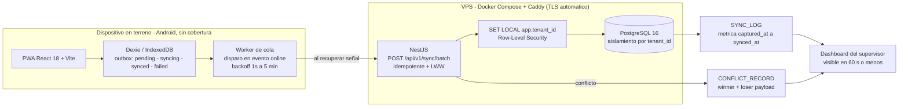

# Terreno Conectado — Datos al día, donde no hay señal

Plataforma SaaS **offline-first** de captura de datos operacionales para faenas mineras y obras de construcción en Chile. Captura local sin conexión, sincronización automática al recuperar señal, multi-tenant con datos aislados por empresa cliente.

Proyecto Capstone (PTY4614) — Duoc UC, Ingeniería en Informática, Sede Alameda.

## Equipo

| Integrante | Rol | GitHub |
| :--- | :--- | :--- |
| Daniel Ávila | Datos / lógica de negocio — specs, modelo de datos | [@danielandresavilaj-cell](https://github.com/danielandresavilaj-cell) |
| Raúl González | Infraestructura / validación — infra, despliegue, testing | [@ev6rlasting](https://github.com/ev6rlasting) |

## Tecnologías utilizadas

| Capa | Tecnología | Por qué |
| :--- | :--- | :--- |
| Lenguaje | **TypeScript** full-stack | un solo lenguaje en el equipo (ADR-001) |
| Frontend | React 18 + Vite | PWA instalable en Android de gama media |
| Almacenamiento local | **Dexie** (IndexedDB) | cola offline transaccional y madura |
| Service worker | **Workbox** | estándar de cache y precache del shell |
| Backend | **NestJS** (monolito modular) | estructura modular, tipos compartidos con el frontend |
| Base de datos | **PostgreSQL 16 + RLS** | aislamiento multi-tenant a nivel de motor |
| Identidad | JWT propio (access 15 min + refresh) | claims de tenant, $0, sin lock-in |
| Identidad de registro | **UUIDv7** generado en cliente | creación offline sin depender del servidor |
| Sincronización | Cola propia + ingesta idempotente por lotes | el corazón del proyecto, no se delega a un BaaS |
| Fotos | Compresión en cliente (canvas) + volumen Docker | $0; evolución a S3 documentada |
| Infra demo | 1 VPS + Docker Compose + Caddy | TLS automático, ~US$5/mes |
| CI/CD | GitHub Actions | 3 jobs en cada push y PR (`.github/workflows/ci.yml`): lint + typecheck + build + check de PWA, tests de integración con Testcontainers, y escaneo de secretos (gitleaks). Deploy pendiente |
| Tests | Vitest + Testcontainers | e2e con supertest contra NestJS + PostgreSQL 16 real: RLS, auth, sync, conflictos, dashboard y `/health` |

Evaluación completa y alternativas descartadas con criterios: [research.md](research.md) · Decisiones firmadas: [adr/](adr/)

## Arquitectura

Tres capas. El terreno nunca depende de la red: la captura es siempre local y la sincronización ocurre después.


```mermaid
flowchart LR
  subgraph TERRENO["Dispositivo en terreno - Android, sin cobertura"]
    PWA["PWA React 18 + Vite"]
    DEX["Dexie / IndexedDB<br/>outbox: pending - syncing - synced - failed"]
    WK["Worker de cola<br/>disparo en evento online<br/>backoff 1s a 5 min"]
    PWA --> DEX --> WK
  end

  subgraph VPS["VPS - Docker Compose + Caddy (TLS automatico)"]
    API["NestJS<br/>POST /api/v1/sync/batch<br/>idempotente + LWW"]
    RLS["SET LOCAL app.tenant_id<br/>Row-Level Security"]
    PG[("PostgreSQL 16<br/>aislamiento por tenant_id")]
    API --> RLS --> PG
  end

  SL["SYNC_LOG<br/>metrica captured_at a synced_at"]
  CR["CONFLICT_RECORD<br/>winner + loser payload"]
  DASH["Dashboard del supervisor<br/>visible en 60 s o menos"]

  WK -->|"al recuperar señal"| API
  PG --> SL --> DASH
  API -->|"conflicto"| CR --> DASH
```

**Decisiones estructurales que sostienen la promesa**

- **Offline-first real (Art. I).** Todo el flujo de captura funciona sin red. La nube es complemento, nunca requisito.
- **Idempotencia (Art. III).** Reenviar un lote nunca duplica: *upsert* por UUIDv7 de cliente. Los conflictos se resuelven con LWW determinista y ambas versiones quedan auditadas en `CONFLICT_RECORD`: nunca hay sobrescritura silenciosa.
- **Aislamiento por motor (Art. IV).** Cada tabla de dominio lleva `tenant_id` y una política RLS. El filtrado de la aplicación es defensa secundaria, no la principal.
- **Presupuesto (Art. VI).** ~US$5/mes en un solo VPS. El diseño de producción real (~US$200-600/mes) está documentado en [adr/002-arquitectura-despliegue.md](adr/002-arquitectura-despliegue.md) sin provisionarse.

Modelo de datos completo (13 tablas): [data-model.md](data-model.md) · Requisitos FR/NFR: [specs/000-master/spec.md](specs/000-master/spec.md)

## Metodología: Spec Driven Development (SDD)

Todo artefacto de código nace de un spec. Ninguna tarea se ejecuta sin requisito trazable.

```
terreno-conectado/
├── constitution.md       ← Principios innegociables (leer primero)
├── specs/
│   ├── 000-master/       ← SPEC MAESTRO: visión, módulos, FR/NFR, alcance (~70-80% del proyecto)
│   ├── 001-auth-tenancy/
│   ├── 002-captura-offline/
│   ├── 003-motor-sincronizacion/
│   ├── 004-dominio-inspecciones/
│   ├── 005-reportes-gerencia/
│   └── 006-admin-plataforma/
├── research.md           ← Stack evaluado y alternativas descartadas con criterios
├── data-model.md         ← Modelo conceptual de datos (evidencia APT Fase 2)
├── test-plan.md          ← Plan de pruebas de validación (evidencia APT Fase 2)
├── adr/                  ← Decisiones arquitectónicas (incl. ejercicio de despliegue/redes/costos)
├── plans/                ← plan.md por módulo (diseño técnico derivado del spec)
├── tasks/                ← tasks.md por iteración (cada tarea referencia FR/NFR del spec)
├── docs/                 ← Guías de trabajo del equipo (tablero, convenciones)
├── Fase 1/
│   └── Evidencias Grupales/    ← Informe de Definición del Proyecto APT (el resto vive en el repo Capstone)
├── frontend/             ← PWA React 18 + Vite instalable; captura offline persistida en Dexie + worker de cola
├── backend/              ← API NestJS: auth JWT, sync idempotente + LWW, conflictos, dashboard y /health
├── shared/               ← Tipos y contratos compartidos entre frontend y backend (ADR-001)
├── infra/                ← Docker Compose (PostgreSQL 16 + RLS local); Caddy y deploy pendientes
└── .github/workflows/    ← CI: 3 jobs - lint+typecheck+build, tests de integración (Testcontainers), gitleaks
```

## Ciclo de trabajo por módulo

`spec → plan → tasks → código → tests → evidencia`

- Specs en **español**; código, tests, commits y CI en **inglés**.
- Spec congelado solo se modifica vía enmienda numerada (PR).
- Infra real solo después del ADR correspondiente entendido y firmado por el equipo.
- Trazabilidad: cada task referencia un ID de requisito (FR/NFR) y cada commit referencia su task.

## Cómo ejecutar localmente

> **Estado real:** el monorepo, la base de datos (PostgreSQL 16 + RLS), la **auth** y la **PWA
> instalable** ya existen. Desde **TSK-WS-005** el `frontend/` **persiste de verdad** en
> Dexie/IndexedDB (inspección, hallazgos, bitácora y outbox local con UUIDv7 de cliente), desde
> **TSK-WS-007** el backend expone `POST /api/v1/sync/batch` (ingesta idempotente + LWW con
> `CONFLICT_RECORD`, **TSK-WS-009**) y desde **TSK-WS-008** el **worker** de cola del cliente
> dispara la sincronización sola al reconectar; el **dashboard del supervisor con datos reales**
> y la **sesión** (login por credenciales, restauración offline de la identidad) llegan en
> **TSK-WS-011**, y **TSK-WS-012** añade `GET /health` + **logs JSON** correlacionados
> (`request_id`/`tenant_id`). Del **Módulo 007** (formularios dinámicos) ya está en `main` su
> documentación completa (Enmienda 002, ADR-003, data-model 1.1.0, spec/plan/tasks 007) y el
> backend de **TSK-FORM-002/003** (plantillas versionadas inmutable + catálogo tipado con Zod en
> `shared/`) y el **renderer data-driven de TSK-FORM-001** (la captura dibuja desde la definición
> de la plantilla activa, con caché offline por tenant) y la **respuesta híbrida de TSK-FORM-004**
> (columnas tipadas + `value_json` JSONB para los tipos date/time/select y **`ATTACHMENT` de
> respuesta** para la foto de ítem) y el **importador `.xlsx` de TSK-FORM-005** (escolta ExcelJS en
> `shared/`, parser determinístico → propuesta `proposed_schema` con secciones/ítems); el resto de
> tareas TSK-FORM sigue en curso.

### Frontend — funciona hoy

App React 18 + Vite 6 + Tailwind 4, seis pantallas (Login, Captura, Bitácora, Cola, Gerencia,
Conflictos) con el ciclo `pending → syncing → synced` animado. Es una **PWA instalable** (TSK-WS-004:
manifest + service worker Workbox con precache del shell: funciona sin red tras la primera carga) y,
desde **TSK-WS-005**, la captura **persiste en el dispositivo**: cada ítem de la inspección se
autoguarda en Dexie/IndexedDB (el borrador se restaura al reabrir, FR-014), los hallazgos y la
bitácora se guardan localmente, y todo queda encolado en un **outbox real** con IDs **UUIDv7** de
cliente (FR-013, FR-015) y orden de dependencia FR-020. Desde **TSK-WS-006** la foto del hallazgo
se **comprime en el dispositivo** antes de encolarse (canvas ≤1280 px, q0.7, FR-012). La cola la
consume el **worker de sincronización** (**TSK-WS-008**): al reconectar (evento `online` del
navegador) o justo después de encolar, dispara el *flush* automático contra
`POST /api/v1/sync/batch` con **concurrencia 1** y **backoff exponencial 1 s→5 min**; cada fila
pasa `pending → syncing → synced` (o `failed` con contador de intentos y `lastError`, FR-016,
FR-022, FR-026). La url de la API se ajusta con `VITE_API_URL` (default `http://localhost:3000/api/v1`).

**Prerrequisitos:** Node.js 22 LTS. Nada más — no necesita Docker ni base de datos para navegar y
capturar offline. Para **iniciar sesión** (TSK-WS-011) sí hace falta el backend arriba
(`npm run dev:backend` en la raíz): el login valida credenciales contra `POST /auth/login` y
devuelve la identidad del tenant; si no hay red, la sesión se restaura desde la caché local
(FR-006).

### Gestión / Dashboard (TSK-WS-011)

`supervisor@minera.cl` / `supervisor@andes.cl` (password `TcDemo2026!`) abren
[http://localhost:5173](http://localhost:5173) en una vista de **Gerencia** con datos reales del
tenant: métricas de inspecciones por estado, hallazgos por severidad, **latencia media/p95
captura→disponibilidad** (FR-040, el dashboard consulta `synced_at − captured_at`), highlight de
hallazgos `alta/crítica` (FR-035) y exportación CSV. Filtros por período (24 h/7 d/30 d), faena y
severidad; auto-refresh cada 30 s releyendo el servidor. Los **conflictos** se listan desde
`GET /api/v1/conflicts` con ambas versiones (winner/loser, Artículo III). Todo vive en
`GET /api/v1/sites`, `GET /api/v1/dashboard/summary` y `GET /api/v1/dashboard/findings`.

```bash
git clone https://github.com/danielandresavilaj-cell/terreno-conectado.git
cd terreno-conectado/frontend

npm install
npm run dev                # Vite  -> http://localhost:5173
```

Otros comandos: `npm run typecheck`, `npm run build` (bundle en `dist/`), `npm run preview`.

Cada push a `main` y cada PR corren lint + typecheck + build en [`.github/workflows/ci.yml`](.github/workflows/ci.yml).

### Monorepo (npm workspaces) — base lista

El monorepo existe (**TSK-WS-001**, enmienda ADR-001 001.1): 4 workspaces —`shared/`, `frontend/`,
`backend/`, `infra/`— y una única `package-lock.json` en la raíz. Instalar, lint, typecheck y build
**ya funcionan**:

```bash
npm install            # instala los 4 workspaces desde la raíz
npm run lint           # ESLint (todo el repo)
npm run typecheck      # tsc en shared/ · frontend/ · backend/
npm run build          # build de frontend (Vite) y backend (tsc)
npm run dev:frontend   # Vite   -> http://localhost:5173
npm run dev:backend    # NestJS -> http://localhost:3000
```
La base de datos local ya existe (**TSK-WS-002**): PostgreSQL 16 con **Row-Level Security**,
migraciones versionadas (`node-pg-migrate`) y seed de tenants A/B. El backend base arranca pero
**aún no persiste** datos de la app (la conexión de la app llega en TSK-WS-003).

```bash
cp .env.example .env                                # credenciales locales (no se versiona)
docker compose -f infra/docker-compose.yml up -d    # PostgreSQL 16 -> :5432
npm run db:migrate --workspace @terreno/backend     # aplica esquema + políticas RLS
npm run db:seed    --workspace @terreno/backend     # tenants A y B + faenas (FR-006)
npm test --workspace @terreno/backend               # integración: aislamiento RLS + auth (Testcontainers)
```

### Auth (TSK-WS-003)

Endpoints (`POST /api/v1/auth/login`, `POST /api/v1/auth/refresh`, `GET /api/v1/me`): JWT HS256 de
15 min con claims `user_id/tenant_id/rol`, refresh token de 30 días en cookie `httponly` con
rotación y detección de reuso (decisión D5), CSRF double-submit, y bloqueo tras 5 credenciales
fallidas (423 por 15 min). El acceso a datos usa el rol `tc_app` + `SET LOCAL app.tenant_id`
(Row-Level Security, TSK-WS-002).

### Sincronización (TSK-WS-007 / 008 / 009)

En `specs/003-motor-sincronizacion/` vive el módulo central. Ingesta por lote en
`POST /api/v1/sync/batch` con orden de dependencias FR-020, **idempotencia** por UUIDv7 cliente +
`client_version` (FR-021) y validación de referencias dentro del tenant. Si dos dispositivos editaron
el mismo registro, gana el **mayor `captured_at`**; si empatan, **mayor `client_version`**; si aún
empatan, **mayor UUIDv7** (tie-breaker determinista §3.1 del plan) — y **las dos versiones se
conservan** en `CONFLICT_RECORD` (winner/loser payload, Artículo III): nunca hay sobrescritura
silenciosa. `sync_log` registra cada batch (`synced_at - captured_at`, FR-024) y `conflict_record`
queda enlazada al batch que la originó. Los bytes de adjunto solo se materializan si esa versión
gana (sin huérfanos). El supervisor/admin consulta los conflictos sin resolver desde
`GET /api/v1/conflicts` (paginated, `limit` 1–100, default 20). El **worker** del cliente (TSK-WS-008)
dispara el flush solo al reconectar, con concurrencia 1 y backoff 1 s→5 min (FR-022).

**Usuarios demo** (seed, password `TcDemo2026!`):

| Tenant | Rol | Email |
| :--- | :--- | :--- |
| A (Minera El Cobre SpA) | trabajador | `trabajador@minera.cl` |
| A (Minera El Cobre SpA) | supervisor | `supervisor@minera.cl` |
| A (Minera El Cobre SpA) | admin | `admin@minera.cl` |
| B (Constructora Andes SpA) | trabajador | `trabajador@andes.cl` |
| B (Constructora Andes SpA) | supervisor | `supervisor@andes.cl` |
| — (plataforma) | admin_plataforma | `admin@terreno.local` |

**Variables de entorno:** copia `.env.example` a `.env` (no se versiona). Ningún secreto se versiona
(Constitución, Art. IX).

`LOG_LEVEL` (backend): `trace|debug|info|warn|error|fatal` (default `info`; `silent` en tests/demo).

### Observabilidad (TSK-WS-012)

- `GET /health` — público, fuera del prefijo `/api/v1` (fácil para un uptime monitor free-tier,
  Uptime Kuma/betterstack, `research.md` §6):
  `200 {"status":"ok","uptime_s":…,"version":"0.1.0","db":"up"}` — `503 {"status":"degraded",…,"db":"down"}`
  cuando PostgreSQL no responde (ping `SELECT 1`, FR-052).
- Logs estructurados **JSON** (NFR-09): una línea por evento con `ts`, `level`, `message`,
  `context` y **SIEMPRE** `request_id` y `tenant_id` (null fuera de un request HTTP). El middleware
  de correlación asigna un `request_id` (UUID) por petición, decodifica `tenant_id` del Bearer y
  emite un **access log** `{"level":"info","context":"http","message":"HTTP GET /health 200 …"}`
  con método, ruta, status y duración.

### Plantillas dinámicas — Módulo 007 (Enmienda 002, en curso)

Ciclo `tenant_admin` importa `.xlsx` → revisión humana → publica `TEMPLATE_REVISION` inmutable →
asigna por faena/rol → el worker captura offline → export del documento rellenado. Ya en `main`:

- **Documentación completa**: `specs/000-master/spec.md` v1.1.0 (Enmienda 002, FR-007–049),
  `specs/007-formularios-dinamicos/spec.md`, `adr/003-formularios-dinamicos.md`,
  `data-model.md` v1.1.0, `plans/007-formularios-dinamicos/` (plan + tasks + spike xlsx) y
  cobertura en `test-plan.md` (FR-007–049, caos 8–11).
- **TSK-FORM-002**: `template` + `template_revision` con RLS por comando y **inmutabilidad en el
  motor** — `tc_app` solo toca revisiones `draft` (FR-007/049); `publish` asigna `version`
  max+1 atómica (base del delta, FR-027).
- **TSK-FORM-003**: contrato **Zod en `shared/src/templates.ts`** (fuente única frontend/backend,
  ADR-003 d2) con los **8 `response_type`** y `props` *strict* por tipo (FR-036/039).
- **TSK-FORM-001**: **render data-driven** en la captura — `FormRenderer` + un control por tipo,
  validación en dispositivo (FR-039), autoguardado por ítem y **caché local de plantillas**
  (`GET /api/v1/templates?since=`, Dexie por tenant); sin red cae a la definición demo.
- **TSK-FORM-004**: **respuesta híbrida** `INSPECTION_RESPONSE` — conserva `value_ok`/`value_text`/
  `value_number` y añade `value_json` JSONB (dates, selects y multi-select) con validación server-side
  (forma + tope 16 384 chars); la **foto de ítem** se asocia a la respuesta como `ATTACHMENT`
  (`owner_type='response'`) encolado en `submitInspection`, con migración idempotente de las fotos
  legacy (`valuePhoto` → ATTACHMENT).
- **TSK-FORM-005**: **importador `.xlsx` determinístico** en `shared/` — la escolta **ExcelJS**
  (`escolta.ts`) normaliza a cuadrícula agnóstica (`CellValueType` real: número/fecha/hora/texto) y el
  parser puro (`import.ts`) propone secciones/ítems con `proposed_schema`, tipo, `props`, `required` y
  origen hoja+celda (FR-029/036/039, export FR-019/044); se consume por subpath (ExcelJS no entra al
  bundle del frontend); autodetección documentada y spike cerrado (enmienda ADR-003,
  `spike-xlsx-result.md`); scripts `npm run spike:xlsx` cableados.

Pendiente (issues #39–#45): UX de import (#39, completado), TEMPLATE_IMPORT + auditoría (#40, completado), asignaciones (#41), delta sync (#42), export (#43), pruebas (#44), V2 (#45).

| Servicio | URL | Estado |
| :--- | :--- | :--- |
| Frontend (Vite) | http://localhost:5173 | funciona (login real + captura offline + dashboard/conflictos) |
| Backend (NestJS, auth + sync) | http://localhost:3000 | funciona (auth, RLS, ingesta idempotente, LWW + conflictos, plantillas versionadas) |
| PostgreSQL 16 | localhost:5432 | funciona (Docker Compose) |
| Health check | http://localhost:3000/health | funciona (TSK-WS-012: 200 `db:up` / 503 `db:down`) |

## Enlaces del proyecto

| Qué | Enlace |
| :--- | :--- |
| Repositorio (monorepo, único) | https://github.com/danielandresavilaj-cell/terreno-conectado |
| Tablero del equipo | https://github.com/users/danielandresavilaj-cell/projects/1 |
| Issues | https://github.com/danielandresavilaj-cell/terreno-conectado/issues |

> Proyecto **monorepo**: `shared/`, `frontend/`, `backend/` e `infra/` viven en un solo repositorio (npm workspaces), por lo que este es el único enlace que hay que entregar.

## Documentos clave para empezar

1. [constitution.md](constitution.md)
2. Evidencias de la asignatura en el repositorio [Capstone](https://github.com/danielandresavilaj-cell/Capstone) — Fase 1 completa (informe APT, guía 1.5, presentación, Carta Gantt y evidencias individuales) y plantillas de Fase 2
3. [specs/000-master/spec.md](specs/000-master/spec.md)
4. [research.md](research.md) · [data-model.md](data-model.md) · [test-plan.md](test-plan.md)
5. [docs/guia-del-tablero.md](docs/guia-del-tablero.md) — cómo navegar, leer y trabajar con el [tablero compartido](https://github.com/users/danielandresavilaj-cell/projects/1)

## Tablero del equipo

El trabajo diario se organiza en el [Project board](https://github.com/users/danielandresavilaj-cell/projects/1): 12 tareas del walking skeleton como sub-issues de la épica de iteración, campos de módulo / owner / prioridad / story points, y milestones M0–M3 alineados al Gantt de la asignatura. Las reglas de trabajo (Definition of Ready, Definition of Done, límite WIP, trazabilidad commit→issue) están en [docs/guia-del-tablero.md](docs/guia-del-tablero.md).
