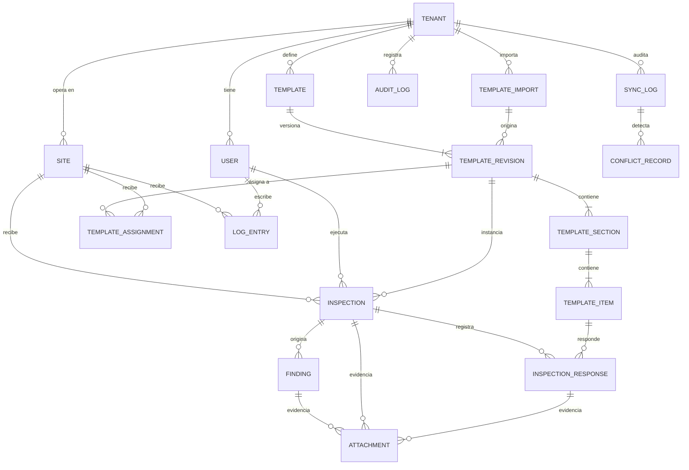

# DATA MODEL — Modelo conceptual de datos

**Versión:** 1.1.0 (módulo 007) · **Fecha:** 2026-09-14 · actualizado 2026-10-07 · **Autor:** Daniel Ávila · **Relacionado:** spec maestro §5/§7 (Enmienda 002), specs 001–007, ADR-003
**Evidencia APT:** "Modelo conceptual de datos preliminar" (informe §6).
**Reglas transversales:** toda tabla de dominio lleva `tenant_id UUID NOT NULL` + política RLS (Artículo IV); IDs `UUIDv7` generados en el cliente cuando el registro nace offline (FR-015); timestamps `created_at`, `updated_at` (servidor) y `captured_at` (cliente, autoridad para LWW — FR-023).

## 1. Diagrama ER conceptual


```mermaid
erDiagram
    TENANT ||--o{ USER : "tiene"
    TENANT ||--o{ SITE : "opera en"
    TENANT ||--o{ TEMPLATE : "define"
    TEMPLATE ||--|{ TEMPLATE_REVISION : "versiona"
    TEMPLATE_REVISION ||--|{ TEMPLATE_SECTION : "contiene"
    TEMPLATE_SECTION ||--|{ TEMPLATE_ITEM : "contiene"
    TEMPLATE_REVISION ||--o{ TEMPLATE_ASSIGNMENT : "asigna a"
    SITE ||--o{ TEMPLATE_ASSIGNMENT : "recibe"
    TENANT ||--o{ TEMPLATE_IMPORT : "importa"
    TEMPLATE_IMPORT ||--o{ TEMPLATE_REVISION : "origina"
    SITE ||--o{ INSPECTION : "recibe"
    USER ||--o{ INSPECTION : "ejecuta"
    TEMPLATE_REVISION ||--o{ INSPECTION : "instancia"
    INSPECTION ||--o{ INSPECTION_RESPONSE : "registra"
    TEMPLATE_ITEM ||--o{ INSPECTION_RESPONSE : "responde"
    INSPECTION ||--o{ FINDING : "origina"
    FINDING ||--o{ ATTACHMENT : "evidencia"
    INSPECTION ||--o{ ATTACHMENT : "evidencia"
    INSPECTION_RESPONSE ||--o{ ATTACHMENT : "evidencia"
    SITE ||--o{ LOG_ENTRY : "recibe"
    USER ||--o{ LOG_ENTRY : "escribe"
    TENANT ||--o{ SYNC_LOG : "audita"
    SYNC_LOG ||--o{ CONFLICT_RECORD : "detecta"
    TENANT ||--o{ AUDIT_LOG : "registra"
```

## 2. Entidades por dominio

### 2.1 Tenancy y usuarios (spec 001)

**TENANT** — empresa cliente del SaaS.
| Campo | Tipo | Notas |
| :--- | :--- | :--- |
| id | UUID PK | |
| name | TEXT | "Minera El Cobre SpA" (demo) |
| slug | TEXT UNIQUE | URL/identificador legible |
| status | ENUM(active, suspended) | FR-050 |
| created_at | TIMESTAMPTZ | |

**USER** — cuenta de cualquier actor.
| Campo | Tipo | Notas |
| :--- | :--- | :--- |
| id | UUID PK | |
| tenant_id | UUID FK→TENANT | RLS; `platform_admin` tiene tenant NULL permitido (bypass auditado, §7 spec maestro) |
| email | CITEXT UNIQUE(tenant_id, email) | |
| password_hash | TEXT | argon2id (NFR-06) |
| role | ENUM(field_worker, supervisor, tenant_admin, platform_admin) | FR-003 |
| full_name | TEXT | |
| is_active | BOOLEAN | |

**SITE (Faena/Obra)**
| Campo | Tipo | Notas |
| :--- | :--- | :--- |
| id, tenant_id | UUID | |
| name | TEXT | |
| kind | ENUM(mining, construction) | |
| location | GEOGRAPHY(Point) NULL | georreferencia opcional (FR-034) |

### 2.2 Plantillas e inspecciones (spec 004 / módulo 007)

**TEMPLATE (InspectionTemplate)** — cabecera del formulario.
| Campo | Tipo | Notas |
| :--- | :--- | :--- |
| id | UUID PK | |
| tenant_id | UUID FK→TENANT | RLS |
| name | TEXT | |
| description | TEXT NULL | |
| status | ENUM(active, archived) | baja lógica (§4.4) |
| created_at / updated_at | TIMESTAMPTZ | |

**TEMPLATE_REVISION** — contenido versionado e inmutable (módulo 007, FR-049).
| Campo | Tipo | Notas |
| :--- | :--- | :--- |
| id | UUID PK | |
| template_id | UUID FK→TEMPLATE | |
| tenant_id | UUID FK→TENANT | RLS |
| version | INT | incrementa por publicación; base del delta `since=` (FR-027) |
| definition | JSONB | secciones + ítems completos (render offline, ADR-003) |
| status | ENUM(draft, published, archived) | se congela al publicar (FR-049) |
| source_import_id | UUID FK→TEMPLATE_IMPORT NULL | origen `.xlsx` si nació de un import |
| published_at | TIMESTAMPTZ NULL | |
| created_at | TIMESTAMPTZ | |

**TEMPLATE_IMPORT** — importación de documento (módulo 007, FR-029).
`id, tenant_id, uploaded_by UUID FK→USER, file_key TEXT, file_name TEXT, status ENUM(uploaded, parsed, proposed, confirmed, failed), proposed_schema JSONB NULL (mapeo columnas→ítems; lo propone el backend — con flag `ai` activo lo refina, FR-048), error TEXT NULL, created_at, confirmed_at TIMESTAMPTZ NULL`. La revisión `draft` nacida del import se asocia por `source_import_id` y **solo se publica tras confirmación humana** (FR-029); RLS por `tenant_id`.

**TEMPLATE_ASSIGNMENT** — asignación faena+rol (FR-008/009).
`id, tenant_id, template_revision_id UUID FK→TEMPLATE_REVISION (published), site_id UUID FK→SITE NULL (NULL = todas las faenas), role ENUM(field_worker, supervisor), active BOOLEAN, assigned_by UUID FK→USER, assigned_at`. UNIQUE `(template_revision_id, site_id, role)`. El `field_worker` consulta solo revisiones publicadas asignadas a su faena y rol (FR-009); RLS por `tenant_id`.

**TEMPLATE_SECTION** — `id, revision_id UUID FK→TEMPLATE_REVISION, position INT, title TEXT`.

**TEMPLATE_ITEM** — `id, section_id, position, prompt TEXT, response_type ENUM(ok_nok_na, text, numeric, date, time, select_single, select_multiple, photo)` (8 tipos V1, FR-036), `require_finding_on_nok BOOLEAN, props JSONB NULL (min/max, options[], required, photo_max_kb), help TEXT`.

**INSPECTION**
| Campo | Tipo | Notas |
| :--- | :--- | :--- |
| id | UUID PK (cliente, UUIDv7) | FR-015 |
| tenant_id, site_id, template_id | UUID FK | |
| template_revision_id | UUID FK→TEMPLATE_REVISION | congela la revisión exacta (FR-028/038) |
| template_version | INT | desnormalizado para queries (deriva de la revisión) |
| executed_by | UUID FK→USER | |
| status | ENUM(draft, in_progress, submitted, reviewed) | FR-031 |
| captured_at | TIMESTAMPTZ (cliente) | autoridad LWW |
| synced_at | TIMESTAMPTZ NULL (servidor) | métrica de latencia NFR-03/FR-024 |
| client_version | INT | contador de edición local para conflictos |
| geo | GEOGRAPHY NULL | |

**INSPECTION_RESPONSE** — `id, inspection_id, template_item_id, tenant_id, value_ok ENUM(ok,nok,na) NULL, value_text NULL, value_number NULL, value_json JSONB NULL (select_single/select_multiple/date/time; validado contra `TEMPLATE_ITEM.props` antes de encolar, FR-039), captured_at, client_version`.

**FINDING (Hallazgo)** — `id, inspection_id NULL, response_id NULL, tenant_id, severity ENUM(low, medium, high, critical), description TEXT, status ENUM(open, in_progress, resolved), captured_at, client_version`.

**LOG_ENTRY (Bitácora)** — `id, site_id, author_id, tenant_id, entry_text TEXT, tags TEXT[], shift_date DATE, captured_at, client_version`.

**ATTACHMENT (Foto)** — `id, tenant_id, owner_type ENUM(inspection, finding, log_entry, response), owner_id, file_key TEXT, mime, bytes INT, width/height INT, captured_at, client_version`. `owner_type` incluye **`response`** (módulo 007, FR-037): la foto de un ítem se asocia a su respuesta. V1: `file_key` apunta a volumen Docker; evolución S3 documentada en research.md §6.

### 2.3 Sincronización y auditoría (spec 003 / 006)

**SYNC_LOG** — `id, tenant_id, user_id, device_id UUID, batch_id UUID, records_total INT, records_ok INT, records_failed INT, started_at, finished_at, status ENUM(pending, ok, partial, failed)`. Se abre en dos fases (`pending` → `UPDATE` con totales y `finished_at`, TSK-WS-009) para que `conflict_record.sync_log_id` referencie el batch. Satisface FR-024 y alimenta el dashboard (latencia media).

**CONFLICT_RECORD** — `id, tenant_id, entity_type, entity_id, winner_payload JSONB, loser_payload JSONB, resolution ENUM(lww), resolved_at, sync_log_id`. Ambas versiones conservadas (FR-023, Artículo III); append-only (REVOKE DELETE desde `tc_app`, TSK-WS-009).

**AUDIT_LOG** (append-only, FR-051) — `id, tenant_id NULL, actor_id, action TEXT, entity_type, entity_id, payload JSONB, occurred_at`. Sin UPDATE/DELETE (permisos DB).

### 2.4 Cliente local (IndexedDB/Dexie — no es PostgreSQL)

| Store | Contenido |
| :--- | :--- |
| `outbox` | Cola de sync: `{batchable records por entidad, status: pending/syncing/synced/failed, retries, last_error}` (FR-013, FR-020/22) |
| `inspections / responses / findings / logEntries / attachments(blobs)` | Copia local de trabajo offline (FR-011, FR-014) |
| `templates_cache` | Revisiones publicadas asignadas al trabajador (FR-018), para captura 100% offline |
| `meta` | sesión, tenant_id, device_id (UUID persistente del dispositivo), cuotas (FR-017) |

## 3. Multi-tenancy — implementación RLS

```sql
-- Patrón por tabla de dominio (ejemplo inspection)
ALTER TABLE inspection ENABLE ROW LEVEL SECURITY;
CREATE POLICY tenant_isolation ON inspection
  USING (tenant_id = current_setting('app.tenant_id', true)::uuid);
-- La app fija por transacción: SET LOCAL app.tenant_id = '<uuid del JWT>';
-- platform_admin: rol DB separado con bypass explícito, solo endpoints admin, auditado.
```

Índices mínimos: `(tenant_id, captured_at DESC)` en tablas de dominio; `(tenant_id, status)` en outbox/inspection; GIN sobre `tags` en log_entry.

## 4. Reglas de integridad clave

1. **Idempotencia de ingesta:** `INSERT ... ON CONFLICT (id) DO UPDATE ... WHERE excluded.client_version > inspection.client_version` (upsert por UUID cliente + versión → FR-021/023); aplica también a `template_import` (FR-029).
2. **Orden de dependencias del batch:** site → template (revisiones, imports, asignaciones) → inspection → responses → findings → log_entries → attachments (FR-020); un lote se rechaza completo si cruza tenants (FR-025).
3. **Latencia medida:** `synced_at - captured_at` por registro; agregado diario por tenant para dashboard (FR-040).
4. **Retención demo:** sin borrado físico; `is_active`/status para baja lógica.
5. **Congelamiento de revisiones:** `TEMPLATE_REVISION.published` es inmutable (sin UPDATE/DELETE desde `tc_app`); todo cambio exige una nueva revisión `draft → published` (FR-049). Las respuestas se validan contra `TEMPLATE_ITEM.props` en el dispositivo antes de encolar (FR-039).
6. **Delta de plantillas:** el cliente guarda el `template_version` máximo conocido por tenant y tira solo el delta (FR-027); una inspección en curso conserva su `template_revision_id` (FR-028/038) incluso si llega una versión nueva.

## 5. Datos semilla (demo académica)

- Tenant A "Minera El Cobre SpA": 1 faena, 2 plantillas (inspección de seguridad diaria / checklist de equipo), 4 usuarios (1 field_worker, 1 supervisor, 1 tenant_admin, 1 platform_admin global), ~30 inspecciones históricas simuladas (faker es-CL).
- Tenant B "Constructora Andes SpA": 1 obra, 1 plantilla (bitácora de obra), 2 usuarios — existe para probar aislamiento en vivo (spec maestro §7).
- Módulo 007: 1 `TEMPLATE_IMPORT` de ejemplo confirmado (`.xlsx` → revisión publicada con `source_import_id`) + asignaciones por faena/rol para las plantillas publicadas (FR-008).

## 6. Control de cambios

| Versión | Fecha | Cambio |
| :--- | :--- | :--- |
| 1.0.0 | 2026-09-14 | Modelo base (specs 001–006) |
| 1.1.0 | 2026-10-07 | **Módulo 007 (Enmienda 002):** `TEMPLATE_REVISION` inmutable (draft/published/archived, `source_import_id`), `TEMPLATE_IMPORT` (uploaded/parsed/proposed/confirmed/failed, `proposed_schema`), `TEMPLATE_ASSIGNMENT` (faena/rol); `TEMPLATE_ITEM` ampliado a 8 `response_type` + `props JSONB`; `INSPECTION_RESPONSE` +`value_json JSONB`; `ATTACHMENT.owner_type` +`response`; inspección congela `template_revision_id` |
