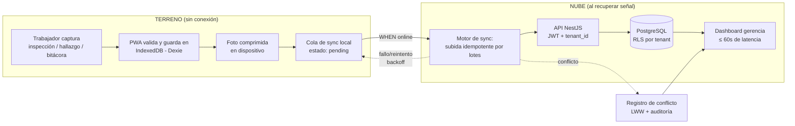

# SPEC MAESTRO — Terreno Conectado, Datos al día donde no hay señal

| | |
| :--- | :--- |
| **ID** | 000-master |
| **Versión** | 1.0.0 |
| **Estado** | BORRADOR PARA REVISIÓN (pendiente firma Daniel + Raúl) |
| **Dueños** | Daniel Ávila (datos/negocio) · Raúl González (infra/plataforma) |
| **Fuente** | Informe de Definición APT, Fase 1 (2026-09-04) |
| **Specs derivados** | 001-auth-tenancy · 002-captura-offline · 003-motor-sincronizacion · 004-dominio-inspecciones · 005-reportes-gerencia · 006-admin-plataforma |

> Este documento concentra ~70–80% de la definición del proyecto: visión, actores, módulos, requisitos funcionales (EARS), requisitos no funcionales, modelo multi-tenant, límites de alcance, MVP, criterios de aceptación de la demo y mapeo a evidencias APT. Los specs de módulo profundizan el 20–30% restante.

---

## 1. Problema y contexto

Faenas mineras y obras de construcción remotas en Chile operan gran parte de su superficie **sin cobertura de red estable**. Los equipos de terreno registran inspecciones, bitácoras y datos operacionales en papel o planillas. Consecuencias (fundamentadas en el informe APT §3.1):

- La gerencia decide con información desactualizada (brecha de días entre captura y disponibilidad).
- Trabajo administrativo duplicado (horas-hombre perdidas en transcripción y consolidación).
- Riesgos de seguridad que pasan inadvertidos más tiempo del debido.
- Reportes inconsistentes entre sistemas.

**Propuesta de valor:** reducir la brecha de tiempo entre la captura del dato en terreno y su disponibilidad para la toma de decisiones, mediante una plataforma SaaS offline-first multi-empresa.

## 2. Actores / Personas

| Actor | Contexto | Necesidad clave |
| :--- | :--- | :--- |
| **Trabajador de terreno** | Faena/obra sin conectividad; teléfono o tablet gama media; guantes, polvo, luz solar | Capturar rápido y sin fricción, confiar en que nada se pierde |
| **Supervisor / Jefe de faena u obra** | Se mueve entre terreno y oficina; consolida lo del equipo | Ver el estado del turno, revisar hallazgos, validar inspecciones |
| **Gerencia / Planificación** | Oficina central; no pisa terreno | Dashboards y reportes confiables, al día, exportables |
| **Admin de tenant (empresa cliente)** | Oficina del cliente | Gestionar sus usuarios, faenas y plantillas de inspección |
| **Admin de plataforma** | Nosotros (operador del SaaS) | Crear tenants, ver salud del sistema, auditar |

## 3. Visión de la solución

Aplicación web **PWA offline-first**: el trabajador captura inspecciones, hallazgos (con foto comprimida) y bitácora en el dispositivo aunque esté en modo avión; los datos viven primero en IndexedDB y se encolan; **apenas vuelve la señal, una cola de sincronización idempotente sube todo sin acción del usuario**; el backend (monolito NestJS + PostgreSQL con RLS) consolida por tenant y la gerencia lo ve en dashboards en ≤ 60 s desde la reconexión. Un mismo despliegue sirve a varias empresas cliente con datos completamente aislados.

### 3.1 Flujo de captura → decisión (boceto del flujo — evidencia APT)

## 4. Módulos del sistema

| # | Módulo | Spec | Dueño | Resumen |
| :--- | :--- | :--- | :--- | :--- |
| 001 | Autenticación y tenancy | `specs/001-auth-tenancy/` | Raúl | Login, JWT con claim de tenant, roles, aislamiento |
| 002 | Captura offline (PWA) | `specs/002-captura-offline/` | Daniel | Formularios offline, IndexedDB, fotos comprimidas, cola local |
| 003 | Motor de sincronización | `specs/003-motor-sincronizacion/` | Daniel | Sync idempotente, reintentos, conflictos, auditoría |
| 004 | Dominio inspecciones | `specs/004-dominio-inspecciones/` | Daniel | Plantillas, inspecciones, hallazgos, bitácoras, faenas |
| 005 | Reportes y gerencia | `specs/005-reportes-gerencia/` | Daniel | Dashboards, latencia captura→disponibilidad, export CSV |
| 006 | Administración plataforma | `specs/006-admin-plataforma/` | Raúl | Gestión de tenants, usuarios, auditoría, health |

## 5. Requisitos funcionales (formato EARS)

Convención EARS en español: ubicuo (`EL SISTEMA DEBERÁ…`), evento (`CUANDO…`), estado (`MIENTRAS…`), no deseado (`SI… ENTONCES…`), opcional (`DONDE…`).

### 5.1 Módulo 001 — Autenticación y tenancy

- **FR-001** EL SISTEMA DEBERÁ autenticar usuarios con email y contraseña (hash argon2/bcrypt) y emitir un JWT de corta duración con claims `user_id`, `tenant_id`, `rol`.
- **FR-002** CUANDO un usuario se autentica, EL SISTEMA DEBERÁ restringir todo acceso a datos de su propio tenant mediante Row-Level Security en PostgreSQL.
- **FR-003** EL SISTEMA DEBERÁ soportar los roles: `field_worker`, `supervisor`, `tenant_admin`, `platform_admin`, con permisos crecientes definidos en el spec 001.
- **FR-004** CUANDO el JWT expira, EL SISTEMA DEBERÁ permitir renovación con refresh token sin perder la cola de sync local pendiente.
- **FR-005** SI las credenciales son inválidas 5 veces consecutivas, ENTONCES EL SISTEMA DEBERÁ aplicar un bloqueo temporal de 15 minutos (rate-limit por cuenta e IP).
- **FR-006** EL SISTEMA DEBERÁ incluir un tenant demo sembrado (empresa ficticia, faena ficticia, usuarios de cada rol) para la demostración académica.

### 5.2 Módulo 002 — Captura offline (PWA)

- **FR-010** EL SISTEMA DEBERÁ ser una PWA instalable (manifest + service worker) que funciona sin red tras la primera carga.
- **FR-011** MIENTRAS el dispositivo no tiene conectividad, EL SISTEMA DEBERÁ permitir crear y editar inspecciones, respuestas de checklist, hallazgos (texto + foto) y entradas de bitácora, guardándolos en IndexedDB (Dexie).
- **FR-012** CUANDO el trabajador adjunta una foto, EL SISTEMA DEBERÁ comprimirla en el dispositivo (máx. 1280 px lado mayor, calidad 0.7, configurable) antes de encolarla; DONDE el feature flag `photos` esté desactivado, EL SISTEMA DEBERÁ ocultar la captura fotográfica.
- **FR-013** EL SISTEMA DEBERÁ mostrar el estado de cada registro local: `pending`, `syncing`, `synced`, `failed`, con contador visible de pendientes.
- **FR-014** EL SISTEMA DEBERÁ conservar los datos locales no sincronizados al cerrar y reabrir la aplicación (incl. reinicio del dispositivo).
- **FR-015** EL SISTEMA DEBERÁ generar identificadores UUIDv7 en el cliente para cada registro, de modo que la sincronización posterior no dependa de IDs asignados por el servidor.
- **FR-016** CUANDO el navegador recupera conectividad (evento `online`), EL SISTEMA DEBERÁ iniciar la sincronización automáticamente sin acción del usuario.
- **FR-017** SI el almacenamiento local supera el 80% de la cuota estimada, ENTONCES EL SISTEMA DEBERÁ advertir al trabajador y priorizar la subida de fotos ya sincronizables.

### 5.3 Módulo 003 — Motor de sincronización

- **FR-020** CUANDO hay conectividad y registros en estado `pending`, EL SISTEMA DEBERÁ subirlos por lotes (batch) respetando el orden de dependencias (faena → inspección → respuestas → hallazgos → fotos).
- **FR-021** EL SISTEMA DEBERÁ ser idempotente: reintentar un lote ya procesado (total o parcialmente) no crea duplicados (upsert por UUID cliente).
- **FR-022** SI un lote falla por red, ENTONCES EL SISTEMA DEBERÁ reintentarlo con backoff exponencial (1 s → 2 s → 4 s → … máx. 5 min) sin intervención del usuario.
- **FR-023** SI dos dispositivos editan el mismo registro offline, ENTONCES EL SISTEMA DEBERÁ resolver con Last-Write-Wins basado en `captured_at`/`updated_at`, conservando ambas versiones en un registro de conflictos visible para el supervisor.
- **FR-024** EL SISTEMA DEBERÁ registrar cada sincronización (éxito/fallo/conflicto) en un log auditable por tenant con métrica de latencia `captured_at → synced_at`.
- **FR-025** SI un intento de sync incluye datos de un tenant distinto al del JWT, ENTONCES EL SISTEMA DEBERÁ rechazar el lote completo y registrar el incidente (defensa en profundidad sobre RLS).
- **FR-026** CUANDO la sincronización termina, EL SISTEMA DEBERÁ marcar los registros locales como `synced` y actualizar el contador de pendientes.

### 5.4 Módulo 004 — Dominio inspecciones

- **FR-030** EL SISTEMA DEBERÁ permitir al `tenant_admin` definir plantillas de inspección: secciones e ítems con tipos de respuesta `ok/nok/na`, texto, numérico y foto obligatoria/opcional.
- **FR-031** EL SISTEMA DEBERÁ gestionar el ciclo de vida de una inspección: `draft → in_progress → submitted → reviewed`.
- **FR-032** CUANDO un ítem se responde `nok`, EL SISTEMA DEBERÁ exigir (configurable por plantilla) un hallazgo asociado con severidad (`baja/media/alta/crítica`), descripción y evidencia fotográfica opcional.
- **FR-033** EL SISTEMA DEBERÁ permitir registrar bitácoras de turno: entradas cronológicas con autor, texto, tags y faena asociada.
- **FR-034** EL SISTEMA DEBERÁ asociar cada captura (inspección/bitácora/hallazgo) a una faena u obra del tenant, con geolocalización opcional si el dispositivo la provee.
- **FR-035** CUANDO un hallazgo de severidad `alta` o `crítica` se sincroniza, EL SISTEMA DEBERÁ destacarlo inmediatamente en el dashboard del supervisor (sin notificaciones push en V1 — fuera de alcance).

### 5.5 Módulo 005 — Reportes y gerencia

- **FR-040** EL SISTEMA DEBERÁ ofrecer un dashboard por tenant con: inspecciones del período por estado, hallazgos por severidad, pendientes de sincronización conocidos y latencia media captura→disponibilidad.
- **FR-041** EL SISTEMA DEBERÁ permitir filtrar por faena, rango de fechas, severidad y autor.
- **FR-042** EL SISTEMA DEBERÁ exportar las vistas del dashboard y el listado de inspecciones/hallazgos a CSV.
- **FR-043** CUANDO un dato se sincroniza, EL SISTEMA DEBERÁ hacerlo visible en el dashboard en ≤ 60 segundos (ver NFR-03).

### 5.6 Módulo 006 — Administración plataforma

- **FR-050** EL SISTEMA DEBERÁ permitir al `platform_admin` crear tenants, asignarles `tenant_admin` inicial y habilitar/deshabilitar el tenant.
- **FR-051** EL SISTEMA DEBERÁ registrar en un audit log inmutable (append-only) las operaciones críticas: creación de tenant, cambios de rol, conflictos de sync, intentos cross-tenant.
- **FR-052** EL SISTEMA DEBERÁ exponer un endpoint `/health` (uptime, versión, estado de DB) consumible por el monitoreo (QA).

## 6. Requisitos no funcionales

| ID | Categoría | Requisito |
| :--- | :--- | :--- |
| **NFR-01** | Offline-first | 100% del flujo de captura opera sin red (Artículo I de la constitución). |
| **NFR-02** | Capacidad offline | ≥ 72 h continuas offline con ≥ 200 registros y ≥ 100 fotos sin pérdida ni corrupción. |
| **NFR-03** | Latencia de sync | Tras reconexión con conectividad normal (≥ 5 Mbps), cola completa de 72 h sincronizada y visible en dashboard en ≤ 5 min; primer lote visible en ≤ 60 s. |
| **NFR-04** | Integridad | Cero pérdida y cero duplicación bajo las pruebas de caos del test-plan (Artículo III). |
| **NFR-05** | Aislamiento | Ninguna consulta devuelve datos de otro tenant (RLS probado en CI, Artículo IV). |
| **NFR-06** | Seguridad | TLS obligatorio (Caddy), argon2/bcrypt para contraseñas, JWT ≤ 15 min + refresh, secretos fuera del repo, checklist OWASP Top 10 en revisión de PRs. |
| **NFR-07** | Rendimiento cliente | PWA usable en Android gama media (4 GB RAM, Chrome ≥ 100): Lighthouse Performance ≥ 80 (mobile), interacción < 200 ms en formularios. |
| **NFR-08** | Presupuesto | Infraestructura demo ≤ US$7/mes (Artículo VI). Sin servicios de pago no documentados. |
| **NFR-09** | Observabilidad | `/health`, uptime monitoring externo (free tier), logs estructurados JSON con `tenant_id` y `request_id`. |
| **NFR-10** | Idiomas | Documentación en español; código, tests, commits, variables y CI en inglés. UI de la app en español (es-CL). |
| **NFR-11** | Simplicidad | Monolito NestJS + PWA React; un solo lenguaje (TypeScript); dependencias justificadas en research.md (Artículo V). |
| **NFR-12** | Trazabilidad SDD | 100% de tasks referencian FR/NFR; 100% de FR con al menos un test (Artículos II y VII). |

## 7. Modelo multi-tenant

- **Estrategia:** base de datos compartida, esquema compartido, discriminador `tenant_id` en toda tabla de dominio + **Row-Level Security de PostgreSQL** como mecanismo de aislamiento (defensa primaria). La aplicación filtra además por tenant (defensa secundaria).
- **Cadena de confianza:** login → JWT con `tenant_id` → conexión DB fija `app.tenant_id` vía `SET LOCAL` por transacción → políticas RLS `USING (tenant_id = current_setting('app.tenant_id')::uuid)`.
- **`platform_admin`:** rol fuera de RLS de tenant (bypass explícito y auditado) solo para administración.
- **Datos por tenant:** usuarios, faenas, plantillas, inspecciones, hallazgos, bitácoras, conflictos, auditoría.
- **Demo:** tenant semilla "Minera El Cobre SpA" + tenant semilla "Constructora Andes SpA" para probar aislamiento en vivo (Artículo IV / evidencia).

Detalle físico (tablas, índices, políticas): `data-model.md`.

## 8. Stack tecnológico (resumen — decisión completa en ADR-001 y research.md)

| Capa | Tecnología |
| :--- | :--- |
| Frontend | PWA: React 18 + Vite + TypeScript, Dexie (IndexedDB), Workbox (service worker) |
| Backend | NestJS (Node + TypeScript), monolito modular, REST |
| Base de datos | PostgreSQL 16 + Row-Level Security; IDs UUIDv7 |
| Sync | Cola propia cliente (Dexie) + endpoints idempotentes de ingesta por lotes; LWW + registro de conflictos |
| Fotos | Compresión en cliente (canvas), objetos en disco del VPS (V1); S3-compatible documentado como evolución |
| Infra demo | 1 VPS (Hetzner/Fly ~US$5/mes) + Docker Compose + Caddy (TLS automático) + Postgres en el mismo VPS |
| CI/CD | GitHub Actions: lint → test (unit+E2E) → build → deploy (SSH/compose up) |
| QA/Monitoreo | `/health` + uptime monitor externo free-tier + logs JSON |
| Testing | Vitest (unit), Playwright (E2E), pruebas de caos offline, red-team adversarial cross-model |

## 9. MVP — bucle mínimo vertical (walking skeleton)

El MVP demuestra la promesa completa de punta a punta:

1. `field_worker` inicia sesión (tenant demo) y la PWA queda operativa offline.
2. En modo avión: crea una inspección desde plantilla, responde checklist, registra un hallazgo `nok` con foto comprimida y una entrada de bitácora. Cierra la app, la reabre: todo sigue ahí.
3. Al reconectar, la cola sincroniza sola; estados pasan a `synced`.
4. En ≤ 60 s el `supervisor` ve la inspección y el hallazgo destacado en el dashboard.
5. Prueba en vivo de aislamiento: el usuario del segundo tenant no ve nada del primero.
6. Prueba en vivo de conflicto: dos dispositivos editan la misma inspección offline → al sincronizar, LWW aplica y el conflicto queda visible y auditado.

## 10. Límites de alcance (fuera de V1)

Fuera de alcance explícito — cualquier inclusión requiere enmienda a este spec (Artículo X de la constitución):

- Facturación/cobranza del SaaS (solo se documenta el modelo de negocio conceptual).
- Apps móviles nativas (iOS/Android stores).
- SSO corporativo (SAML/OIDC con el IdP del cliente).
- Notificaciones push.
- Colaboración en tiempo real (edición simultánea con merge fino/CRDT — V1 usa LWW + auditoría).
- Analítica con IA, OCR de formularios de papel.
- Integración con ERPs mineros reales.
- Despliegue productivo multi-región, alta disponibilidad, backups gestionados (se documentan como diseño "real" en ADRs, no se pagan).
- Más de 2 tenants demo.

## 11. Supuestos y restricciones

- Sin acceso a faenas reales: datos simulados (semillas + faker es-CL) y escenarios de desconexión simulados (informe APT §3.5).
- Carga académica paralela de ambos integrantes: presupuesto de horas según planificación semanal del equipo; el Gantt de la asignatura no se modifica (Artículo X).
- Dispositivos objetivo: Chrome/Android gama media y escritorio (demo del docente).
- La asignatura exige prototipo demostrable + pruebas de validación + informe final (evidencias §12).

## 12. Mapeo evidencia APT → artefacto SDD (Artículo VIII)

| Evidencia APT (informe §6) | Tipo | Artefacto en este repo |
| :--- | :--- | :--- |
| Informe de Definición del Proyecto APT | Avance | `~/Downloads/informe-capstone.md` (input, Fase 1 cerrada) |
| Modelo conceptual de datos preliminar | Avance | `data-model.md` |
| Boceto del flujo de captura y sincronización | Avance | §3.1 de este spec (mermaid) + `specs/003-motor-sincronizacion/` |
| Plan de pruebas de validación | Avance | `test-plan.md` |
| Prototipo o maqueta demostrativa | Final | `frontend/` + `backend/` + demo desplegada (ADR-002) + guion de demo (§9) |
| Informe final y presentación de resultados | Final | `docs-evidencia/informe-final/` (Fase 3; consolida specs, resultados de test-plan y ADRs) |
| Plan de trabajo / Carta Gantt | Transversal | Intactos en el informe APT §7–8; el avance SDD se evidencia en `tasks/` e historial git |

## 13. Criterios de aceptación de la demo final

La demo se considera exitosa si, en vivo ante el docente:

1. El guion del §9 (MVP) se ejecuta completo sin intervención manual sobre la red (modo avión real del dispositivo).
2. Las pruebas de caos del test-plan (corte a mitad de sync, duplicidad por reintento, conflicto entre dispositivos) muestran cero pérdida y cero duplicación.
3. La intrusión cross-tenant es rechazada y queda auditada.
4. El dashboard refleja el dato de terreno ≤ 60 s tras reconexión.
5. Cada evidencia de la tabla §12 existe, está actualizada y es navegable desde este README.

## 14. Glosario

| Término | Definición |
| :--- | :--- |
| **Faena / Obra** | Sitio de trabajo remoto (mina o construcción) de un tenant. |
| **Tenant** | Empresa cliente del SaaS; unidad de aislamiento de datos. |
| **Inspección** | Ejecución de una plantilla de checklist en terreno. |
| **Hallazgo** | Desviación o riesgo detectado; nace de un ítem `nok` o directo. |
| **Bitácora** | Registro cronológico libre del turno. |
| **Cola de sync** | Estructura local (IndexedDB) de registros pendientes de subida. |
| **Idempotencia** | Propiedad de que reintentar una operación no cambia el resultado más allá de la primera ejecución exitosa. |
| **LWW** | Last-Write-Wins: política de resolución de conflictos por marca de tiempo más reciente. |
| **RLS** | Row-Level Security: políticas de fila de PostgreSQL que filtran por `tenant_id`. |
| **EARS** | Easy Approach to Requirements Syntax: formato de requisitos usado en §5. |
| **Walking skeleton** | Corte vertical mínimo que atraviesa todas las capas del sistema. |

---

## Control de cambios

| Versión | Fecha | Cambio | Autor |
| :--- | :--- | :--- | :--- |
| 1.0.0 | 2026-09-14 | Borrador inicial derivado del informe APT Fase 1 + decisiones de grilling (Q1–Q14) | Daniel Ávila (con IA) |
| 1.0.1 | 2026-09-23 | Título: "Decisiones en Tiempo Real" → "Datos al día donde no hay señal" (Opción A — alinear la promesa con la realidad offline-first) | Daniel Ávila (con IA) |
